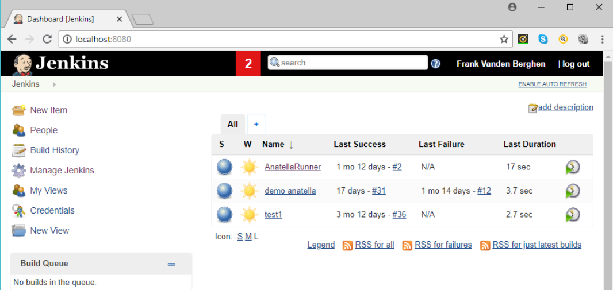

# Jenkins

طبق تعریف خود Jenkins، این برنامه مشهورترین Automation server در دنیای برنامه‌نویسی است. این به طور خلاصه به این معنا است که با استفاده از Jenkins می‌توان خیلی فرایندهای زمان‌گیر در توسعه‌ی نرم‌افزار را اتوماتیک کرد که افراد تیم بتوانند وقت خود را برای کارهای مفیدتری صرف کنند.

از Jenkins معمولاً در چند موقعیت استفاده می‌شود:
- Build گرفتن
- تست‌ها (اجرای بخش‌هایی از کد)
- Static code analysis (بررسی رعایت برخی استانداردها بدون اجرای کد)
- Deploy کردن

کاری که Jenkins انجام می‌دهد واقعاً همینقدر ساده است. با انجام این کارهای تکراری توسط Jenkins، لازم نیست اعضای تیم برای این کارها وقت بگذارند. از طرف دیگر، استفاده از این برنامه باعث می‌شود بتوانیم تست‌ها را مستقیم بر روی کد موجود در مخزن کد انجام دهیم، جایی که همه‌ی کدهای زده شده توسط همه‌ی اعضای تیم موجود است. پیش از این، اجرای تست‌ها فقط روی سیستم شخصی انجام می‌شده که این امکان را ایجاد می‌کرده که نتایج تست‌ها برای کد نهایی صحت نداشته باشد.

این برنامه را می‌توان بر روی پلتفرم‌های گوناگونی نصب کرد. این سیستم ابتدائاً به صورت فایل WAR ارائه شده و به صورت Docker image و installer برای لینوکس و ویندوز هم ارائه می‌شود.

کد Jenkins به زبان جاوا نوشته شده است (با بخش‌های کمی به زبان‌هایی مثل Groovy و Ruby). این برنامه یک web user interface ایجاد می‌کند و ارتباط با آن از طریق REST API است.

استفاده از Jenkins به تیم‌ها کمک می‌کند که continuous integration و continuous delivery داشته باشند. continuous integration به این معنا است که کدهایی که اعضا می‌نویسند به طور منظم چند بار در روز Build و تست می‌شود. continuous delivery به این معنا است که محصول به طور منظم و سریع release شود و در اختیار مشتری قرار بگیرد.

این برنامه تعداد بسیار زیادی Plugin و Extension دارد (بیش از 1600) که هر گونه فعالیتی که قابل اتوماتیک شدن است را انجام دهد. مثلاً برای استفاده از Jenkins برای زبان‌هایی غیر از Java، باید pluginهای خاص آنها استفاده کرد. برای اتصال Jenkins به سیستم‌های مختلف Version control همانند git نیز plugin وجود دارد. کلاً pluginها می‌توانند جنبه‌های بسیاری از Jenkins را تغییر دهند، مثل شکل ظاهری آن و یا طریقه‌ی گزارش‌دهی و یا تست کردن برای دیوایس‌های مختلف. بعد از نصب شدن، می‌توانیم لیست pluginهای مورد نیازمان را مشخص و install کنیم.

در زمان نصب اولیه‌ی Jenkins، یک یوزر admin با یک پسورد تصادفی ایجاد می‌شود که می‌توان برای لاگین از آن استفاده کرد.

در صفحه‌ی اصلی Jenkins که همان Dashboard است، می‌توانیم صف build و وضعیت هر عضو را ببینیم.

بهترین روش استفاده از Jenkins ایجاد یک فایل pipeline script به نام Jenkinsfile و قرار دادن آن در پروژه است. این فایل به چند فرمت می‌تواند نوشته شود.

در کل می‌توان گفت که Jenkins یک راه ساده برای پیاده کردن CI/CD در اختیار ما قرار می‌دهد، به همراه اتوماتیک‌سازی برخی کارهای روتین در روند توسعه‌ی نرم‌افزار.

